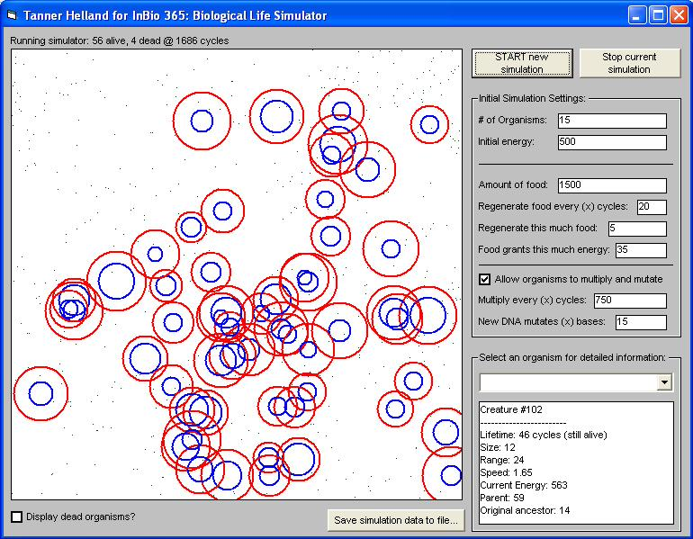



## Biological Life Simulator

### Description

This little program was my final project for a university bioinformatics course. It is designed to represent basic evolutionary and population genetics principles for simple artifical organisms. Basically, simple creatures compete with each other for limited resources. Each organism has a strand of pseudo-DNA that determines three basic attributes: size, speed, and range (how far it can see). When the little critters reproduce (asexually - sorry, everyone :), mutations may take place in the child organism. The code isn't completely optimized, but you may still find that it runs too fast compiled. It can be quite addicting - my longest simulation ran for almost 400,000 cycles before all the organisms died out. For further analysis of a particular simulation, all data can be saved to a tab-delimited text file compatible with any major spreadsheet software. Comments and suggestions are welcome.
 
### More Info
 

             |
---                |---
**Submitted On**   |2007-02-10 15:40:54
**By**             |[Tanner H](https://github.com/Planet-Source-Code/PSCIndex/blob/master/ByAuthor/tanner-h.md)
**Level**          |Intermediate
**User Rating**    |4.8 (38 globes from 8 users)
**Compatibility**  |VB 5\.0, VB 6\.0
**Category**       |[Games](https://github.com/Planet-Source-Code/PSCIndex/blob/master/ByCategory/games__1-38.md)
**World**          |[Visual Basic](https://github.com/Planet-Source-Code/PSCIndex/blob/master/ByWorld/visual-basic.md)
**Archive File**   |[Biological2047352102007\.zip](https://github.com/Planet-Source-Code/tanner-h-biological-life-simulator__1-67837/archive/master.zip)

### API Declarations

SetPixelV, BitBlt

